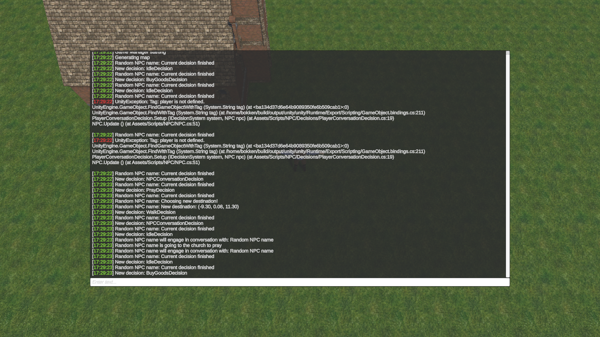

# GitmanikUnityConsole

GitmanikUnityConsole is a in-game console system allows developers to add and execute custom commands during runtime. It provides a flexible and extensible way to debug, test, and interact with your game or application. 

Command system leverages Reflection providing quick and easy solution for creating functions behaving as commands. The console automatically discovers and registers commands from all assemblies in the current domain. The console supports multi-parameter commands, but all parameters must be strings.



## Features

* In-game console with command input
* Custom command system using attributes
* Support for Unity debug log integration
* Customizable console appearance
* Built-in command listing and help functionality

## Installation

1. Add package using **Package Manager**:
    1. Open Package Manager
    2. Install package from git URL..
    3. `https://github.com/Gitmanik/GitmanikUnityConsole.git`
2. Drag GitmanikConsole prefab into your scene
3. Customize layout and appearance to your liking
4. Toggle the console visibility using the ToggleConsole() method.

## Printing to console

Use the following methods to print messages to the console:

```csharp 
Print(string message, string color = "93e743") // Print a regular message
PrintWarning(string message)                   // Print a warning message
PrintError(string message)                     // Print an error message
```

## Configurability

* Enable Unity Logging: Toggle to capture Unity debug logs in the console
* Character Limit: Set a maximum character limit for the console output

## Creating Custom Commands

To create a custom command:

1. Create a static method with the desired functionality.
2. Add the [ConsoleCommand] attribute to the method, specifying the command name and description.
3. Ensure the method returns a bool (true for success, false for failure).

Use string parameters for any command arguments.

Example:

```csharp
[ConsoleCommand("hello", "Prints a greeting message")]
public static bool HelloCommand(string name)
{
    GitmanikConsole.singleton.Print($"Hello, {name}!");
    return true;
}
```

## Limitations

* Only string parameters are supported for custom commands.
* The console is designed for single-instance use (singleton pattern).
